

# job4j_cars

+ [О проекте](#О-проекте)
+ [Технологии](#технологии)
+ [Интерфейс](#интерфейс)
+ [Контакты](#контакты)

## О проекте

Данное веб-приложение представляет собой торговую площадку по продаже автомобилей. Спроектирован по принципу MVC.
Имеется функционал регистрации пользователей. Зарегистрированные пользователи имеют возможность добавлять свои 
объявления о продаже автомобилей, а затем, если это необходимо редактировать уже существующие. Все пользователи, включая 
незарегистрированных могут просматривать объявления. На основной странице имеются всевозможные пользовательские фильтры 
для более удобного отбора подходящих объявлений. Для хранения данных используется Hibernate.

## Технологии

+ Сборщик проектов **Maven**;
+ Frontend - **HTML**, **CSS**, **BOOTSTRAP**, **JS**, **AJAX**, **JQUERY**;
+ Backend - **Java 14**, **Servlet**;
+ Для хранения данных используется фреймворк - **Hibernate**;
+ Логгирование - **Log4j**, **Slf4j**;
+ СУБД - **PostgreSQL**;
+ Контейнер сервлетов - **Apache Tomcat**;
+ Непрерывная интеграция - **Travis CI**;
+ Инструмент для анализа стиля кода - **Checkstyle**;

## Интерфейс

Основная страница:

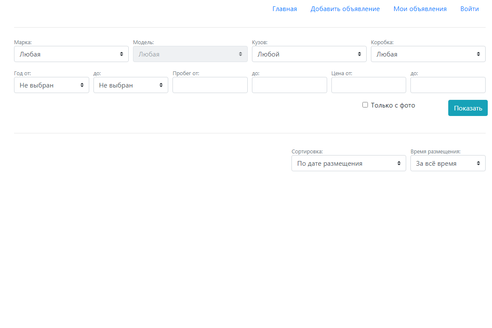

Сверху находится навигационное меню. В данный момент мы не авторизовались. Если кликнем на гиперссылки "Добавить 
объявление" или "Мои объявления", нас перенаправит на страницу авторизации. Также имеется гиперссылка "Войти", 
непосредственно, чтобы перейти на страницу авторизации.

---

В неавторизованном режиме мы имеем возможность использовать пользовательские фильтры на основной странице и 
просматривать объявления. Чтобы вывести объявления, необходимо выбрать интересующие нас фильтры и нажать на кнопку
"Показать". Также можно не выбирать фильтры и просмотреть все объявления:

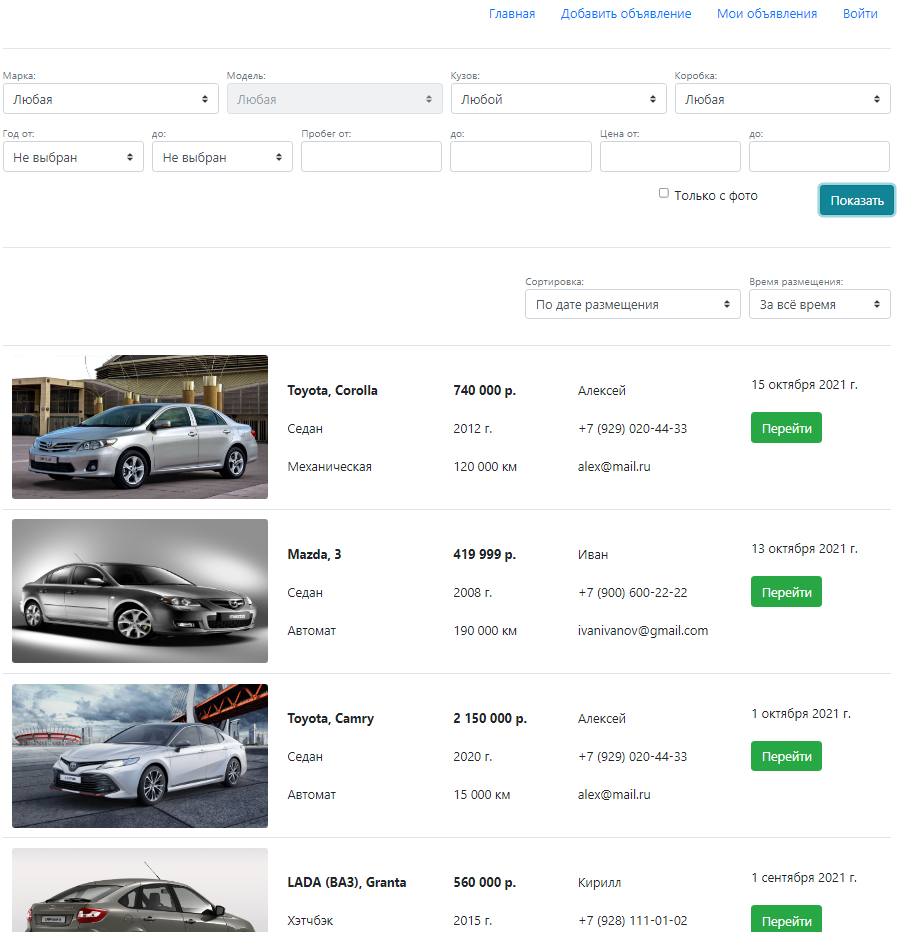

---

Давайте отберем по некоторым фильтрам:

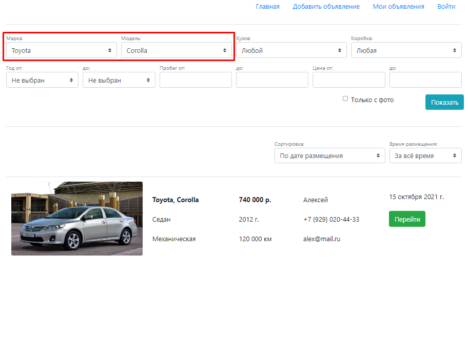

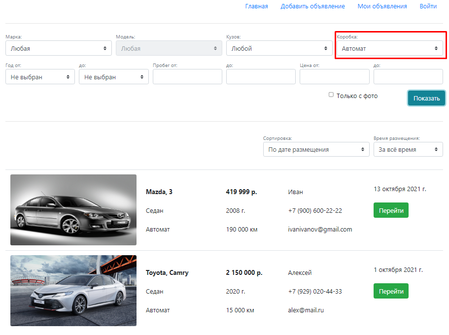

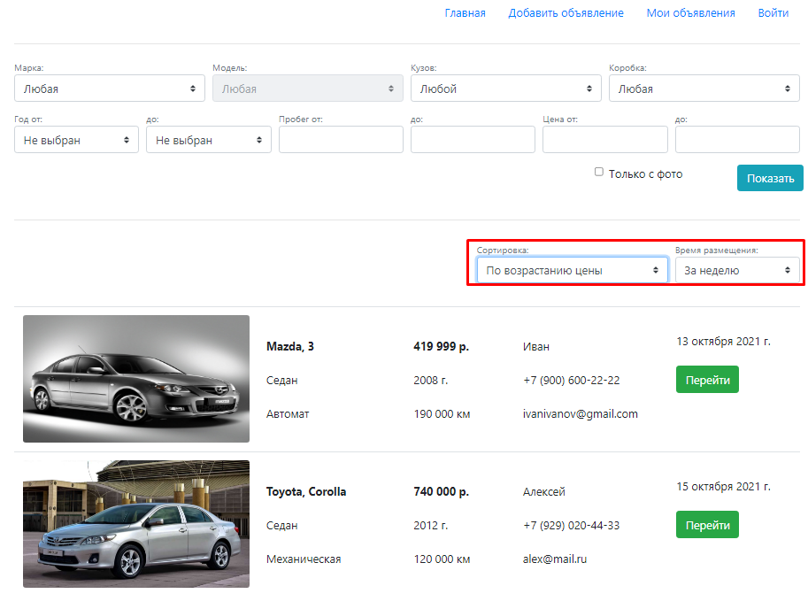

---

Если мы хотим добавлять свои объявления, необходимо авторизоваться. Перейдем на страницу авторизации:

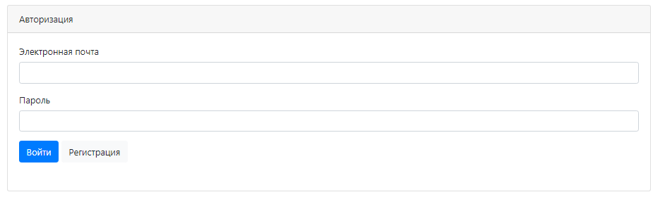

---

Если мы не зарегистрированы, необходимо зарегистрироваться. Перейдем на страницу регистрации. Все поля обязательны к 
заполнению. Для авторизации используется электронная почта. Заполненная страница регистрации выглядит так:

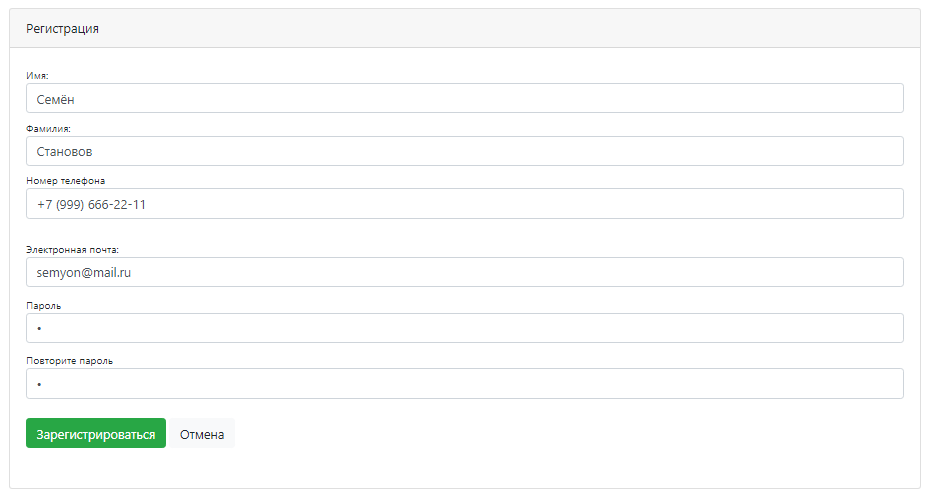

---

После регистрации, нас автоматически перенаправит обратно на страницу авторизации, с уже заполненными полями, 
необходимыми для авторизации:

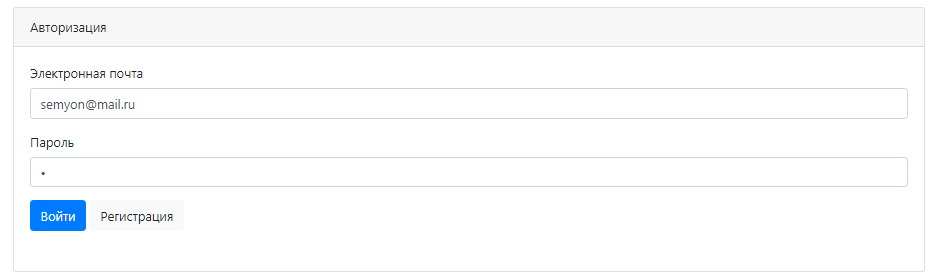

После авторизации нас также автоматически перенаправит на основную страницу.

---

Давайте добавим новое объявление. Кликнем в навигационном меню на гиперссылку "Добавить объявление". Страница с 
незаполненным объявлением выглядит так:

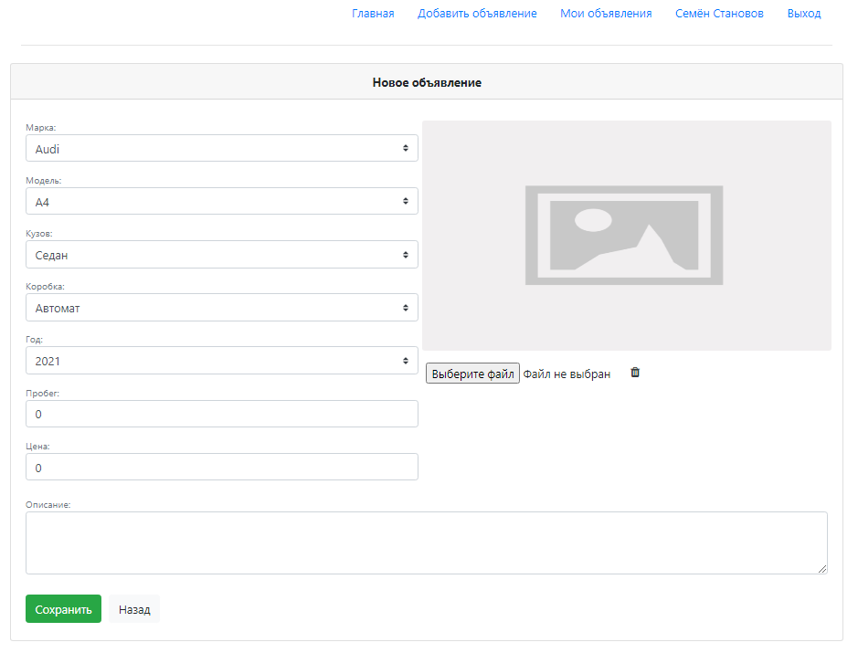

На этой странице можно выбирать необходимы характеристики автомобиля, а также добавлять его фото.

---

Заполним новое объявление и кликнем на кнопку сохранить. При успешном добавлении будет выдана соответствующая надпись
и нас перенаправит на страницу объявлений текущего пользователя. В навигационном меню это гиперссылка "Мои объявления":

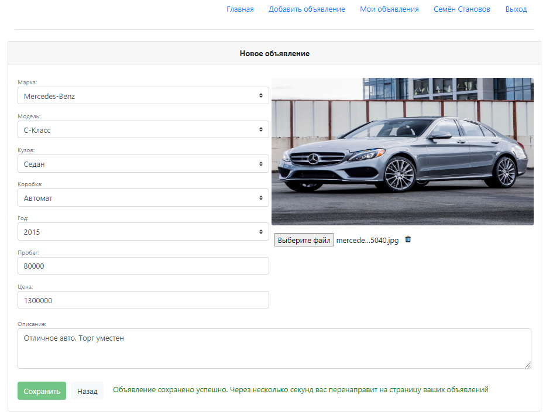

---

На странице объявлений текущего пользователя также имеются фильтры, для более удобной навигации по своим объявлениям.
Страница выглядит так:

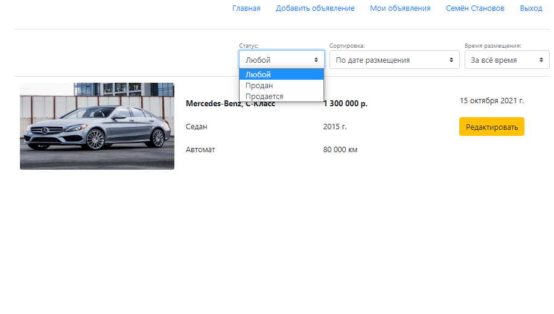

---

Если в объявлении что-то необходимо поменять: характеристики, описание, фото, отметить объявление проданным или вообще 
удалить его, то мы также можем это сделать. Нужно всего лишь нажать на кнопку "Редактировать" на нашем объявлении. 
Сделать это можно со страницы объявлений текущего пользователя или на основной странице, если там будет наше объявление.
Страница редактирования:

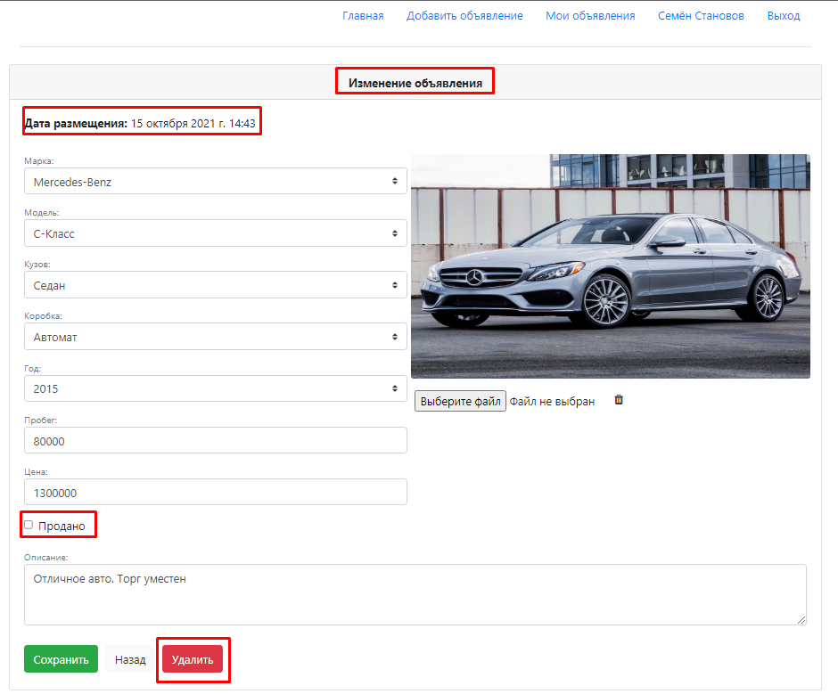

Добавлен чек-бокс - продано/не продано. Неизменяемое поле даты, когда было создано данное объявление. А также кнопка
"Удалить".

---

Вернемся на главную страницу и перейдем в чужое объявление. Если кликнуть на чужом объявлении на кнопку "Перейти", то 
мы перейдем на страницу только для просмотра этого объявления:

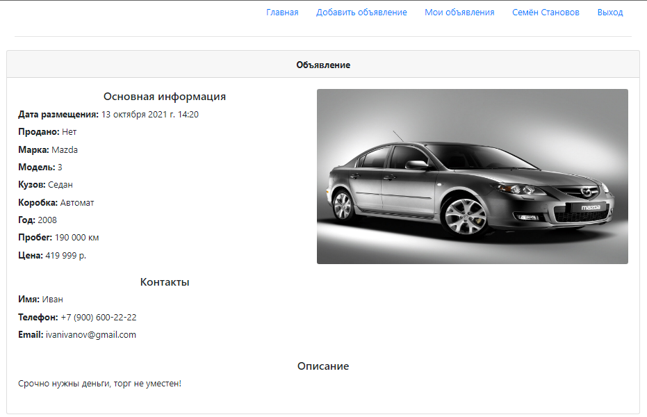

## Контакты

Становов Семён Сергеевич

Email: sestanovov@gmail.com

Telegram: [@stanovovss](https://t.me/stanovovss)